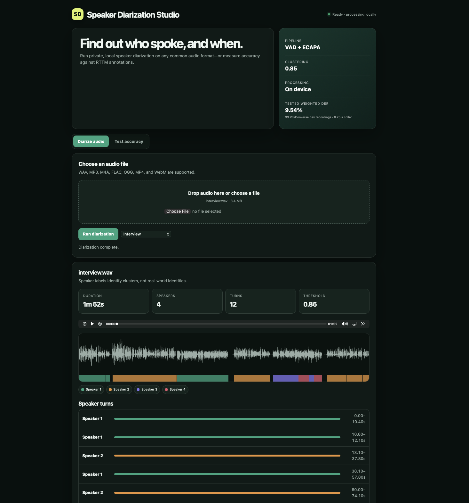

# Speaker Diarization Studio

A self-contained local web app that identifies who spoke and when. It also measures
diarization error rate (DER) from audio files paired with RTTM annotations.



## Features

- Upload WAV, MP3, M4A, AAC, FLAC, OGG, Opus, MP4, or WebM audio.
- Review speaker-colored turns alongside synchronized audio and a waveform.
- Evaluate VoxConverse-style datasets made of matching audio and RTTM files.
- View and export per-file and overall accuracy results as CSV or JSON.
- Run locally in one FastAPI process; uploaded evaluation data is temporary.

The pipeline uses Silero VAD, SpeechBrain ECAPA speaker embeddings, overlapping
two-second speech windows, and agglomerative clustering with a default distance
threshold of `0.85`.

## Tested accuracy

On a tested 33-recording subset of VoxConverse development data, the pipeline
achieved **9.537% duration-weighted DER** and **9.607% aggregate DER**. Evaluation
used a `0.25`-second collar and scored overlapping speech. These numbers apply only
to that fixed subset, not the complete VoxConverse benchmark.

## Run the app

Install these system prerequisites:

- Python 3.12, 3.13, or 3.14
- ffmpeg

On macOS:

```bash
brew install python ffmpeg
```

On Ubuntu or Debian:

```bash
sudo apt update
sudo apt install python3 python3-venv ffmpeg
```

Clone the repository, enter its directory, and run:

```bash
./run.sh
```

The first launch creates `.venv` and installs the required packages. The first
diarization also downloads the speaker model from Hugging Face; model weights are
not stored in this repository. Later launches reuse both the environment and the
downloaded model. The app opens at
[http://127.0.0.1:8000](http://127.0.0.1:8000).

Stop the app with `Ctrl+C`. To launch without opening a browser:

```bash
./run.sh --no-browser
```

## Accuracy-test folder format

Select a folder containing audio and RTTM files with matching basenames:

```text
dataset/
├── audio/
│   ├── recording_1.wav
│   └── recording_2.wav
└── rttm/
    ├── recording_1.rttm
    └── recording_2.rttm
```

The folder may contain unrelated files; the app uses supported audio and `.rttm`
files only. Every selected audio file must have a matching annotation.

## Project layout

```text
app.py                  Application launcher
main.py                 FastAPI server and API routes
dia.py                  Diarization pipeline
voxconverse_utils.py    RTTM parsing and DER scoring
frontend/index.html     Browser interface
samples/                Built-in sample recordings
assets/screenshot.png   README preview
requirements.txt        Python dependencies
run.sh                  One-command setup and launch
```

API documentation is available while the app is running at
[http://127.0.0.1:8000/docs](http://127.0.0.1:8000/docs).
